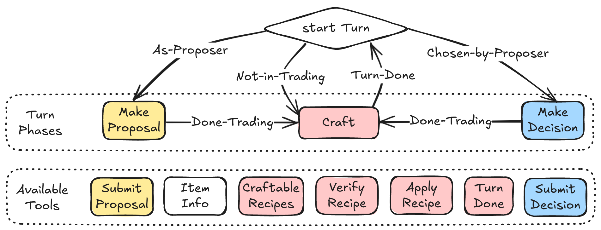
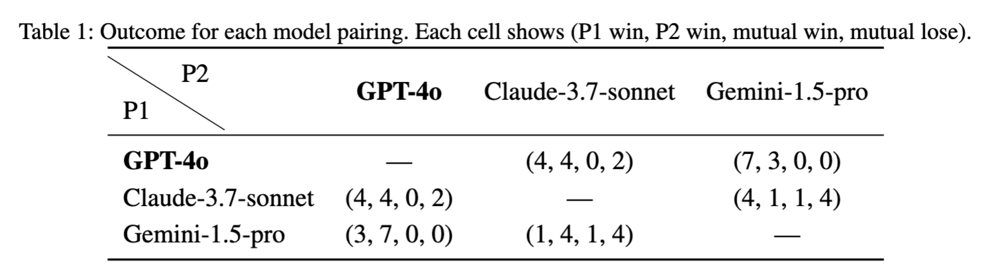
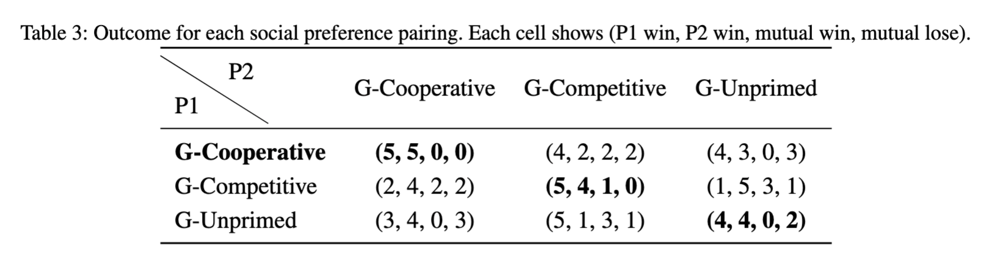

# TradeCraft: an Arena for Long-term Strategic Social Reasoning and Planning

✨ **Highlights** ✨

*   **Advanced Social Intelligence Evaluation**: TradeCraft is a flexible, extensible multi-agent benchmark designed to evaluate high-order Theory of Mind, strategic social reasoning, and planning.
*   **Complex Long-Term Strategy**: Features 944 items, 1,144 crafting recipes, and 84 tag-based substitution rules, requiring agents to manage long multi-step crafting chains under strict compositional constraints.
*   **Dual Interfaces & Comprehensive Evaluation**: Offers a Gymnasium-compatible API for LLMs and a GUI for human players, alongside a multi-dimensional framework to evaluate agent capabilities thoroughly.

<!-- 📖 **Overview**

Developing agents capable of high-order recursive Theory of Mind and strategic social reasoning and planning remains a central challenge in advancing social intelligence, the evaluation of which is also a big challenge. We present *TradeCraft*, a flexible and extensible multi-agent benchmark environment designed to evaluate social intelligence under strict compositional constraints. *TradeCraft* comprises 944 items, 1,144 crafting recipes, and 84 tag-based item substitution rules, which require agents to reason over long multi-step crafting chains while accurately managing both item types and quantities. The platform supports variable participant configurations and dynamic rule conditions, enabling rich and diverse social scenarios. *TradeCraft* features dual interfaces: a Gymnasium-compatible API for integrating large language models and a graphical user interface for human participants, facilitating both human-AI interaction and model evaluation. Our multi-dimensional evaluation framework measures strategic reasoning and planning, cooperative and competitive interaction, resource negotiation, compliance with constraints, and adaptive behavior. By embedding strict rules, dynamic interactions, and trade-based goals, *TradeCraft* incentivizes high-order strategic reasoning and hybrid-motivation behavior, offering a rigorous testbed for agents capable of socially intelligent, long-term decision-making in structured environments. We also comprehensively evaluate current large language models in rich dimensions, providing useful insights into large language models' social intelligence. -->

🚀 **Key Features**

*   **Multi-Agent Social Intelligence Benchmark**: Designed to evaluate high-order recursive Theory of Mind, strategic social reasoning, and planning.
*   **Extensive Crafting System**: Features 944 items, 1,144 crafting recipes, and 84 tag-based item substitution rules, demanding complex, multi-step reasoning.
*   **Dual Interfaces**:
    *   **Gymnasium-Compatible API**: For seamless integration and evaluation of Large Language Models (LLMs) and other AI agents.
    *   **Graphical User Interface (GUI)**: For human participation, observation, and human-AI interaction.
*   **Flexible Configuration**: Supports variable participant numbers and dynamic rule conditions to create diverse social scenarios.
*   **Compositional Constraints**: Enforces strict rules on item crafting and interaction, requiring precise management of item types and quantities.
*   **Long-Horizon Tasks**: Challenges agents with tasks that require planning over extended sequences of actions.
*   **Multi-Dimensional Evaluation Framework**: Assesses:
    *   Strategic reasoning and planning
    *   Cooperative and competitive interaction
    *   Resource negotiation
    *   Compliance with constraints
    *   Adaptive behavior
*   **Incentivizes Advanced Reasoning**: Embeds strict rules, dynamic interactions, and trade-based goals to promote high-order strategic thinking and hybrid-motivation behavior.

🏗️ **Architecture & Pipeline**

*   TradeCraft utilizes a client-server architecture to manage game state and agent interactions.
*   The server hosts the game logic, including the crafting rules, item states, and agent management.
*   Agents (LLMs or human players) connect to the server via:
    *   The **Gymnasium-compatible API** for programmatic control, allowing AI agents to perceive the environment and execute actions.
    *   The **Graphical User Interface (GUI)**, which provides a visual representation of the game world for human players.
*   This dual-interface design allows for flexible experimentation, including AI vs. AI, Human vs. Human, and Human vs. AI setups.



📊 **Benchmark & Evaluation**

*   TradeCraft provides a rigorous testbed for evaluating social intelligence in structured, long-term decision-making environments.
*   Our comprehensive evaluation framework assesses multiple dimensions of agent performance (see Key Features).
*   We have conducted extensive evaluations of current Large Language Models, providing insights into their social intelligence capabilities.

<center>
    
    
</center>


💾 **Dataset & Game Rules**

*   The core of TradeCraft is its rich and complex crafting system:
    *   **Items**: 944 unique items.
    *   **Crafting Recipes**: 1,144 distinct recipes.
    *   **Tag-Based Substitution Rules**: 84 rules allowing for flexible item usage based on tags.
*   These components create a vast combinatorial space, requiring agents to navigate long crafting chains and adapt to dynamic conditions.
*   Game rules are designed to be strict and compositional, ensuring success depends on careful adherence to constraints and strategic interaction.

⚙️ **Setup**

### Installation

```bash
# Create and activate a conda environment (Python 3.10 recommended)
conda create -n tradecraft python=3.10
conda activate tradecraft

git clone git@github.com:TradeCraft-team/TradeCraft.git
cd TradeCraft

# Install dependencies
pip install -r requirements.txt
```

- Download and install mongoDB server: https://www.mongodb.com/try/download/community

### Configuration

Create a `.env` file in the root directory for API configurations:

```
OPENAI_API_KEY=your_openai_api_key
ANTHROPIC_API_KEY=your_claude_api_key
GOOGLE_API_KEY=your_gemini_api_key
# Add other necessary API keys or configurations
```

### Starting the Server

```bash
# Start the game server
# NOTE: mongoDB server is required to run the server, so please install it first
# It will typically run on http://localhost:5000
# ::: Checking MongoDB Connection to MongoDB:127.0.0.1: means failed to connect to the mongoDB server
# after about 30 seconds, it will proceed
cd tradeCraft
python run_server.py
```

### human vs. human

After starting the game server, at least two users need to access the game server's URL and join the same room to play against each other.

### human vs. AI Agent

After a user accesses the game server's URL and selects a room, the user needs to open a new terminal and run the following commands to start an AI agent.

```bash
cd SocialImitationGame
# gpt-4o
python run_gym_agent_4o.py
# or claude-3-7-sonnet
python run_gym_agent_claude.py 
# or gemini-1.5-pro
python run_gym_agent_gemini.py 
```
## Reproduce the results in paper
All the code for evaluation are under the folder **TC_evaluation**, so cd to the folder first: 

```bash

cd TC_evaluation
```
---
**Note:**

- Due to the inherent randomness in LLM outputs, the *model-based* evaluation results you obtain may differ slightly from those reported in the paper.
- In our paper, we use **Gemini-1.5-Pro** as the default assessor model for all model-based evaluations.
---

### 🧪 Evaluation: Different Social Preferences

**Heuristic Evaluation\[Figure 4 (k) and Table 3\]**

To reproduce the heuristic evaluation results of **Gemini-1.5-Pro** with different social preferences, run:

```bash
python evaluator.py -N Heu_SP
````

**Model-based Evaluation\[Figure 4 (d-i)\]**

Before performing model-based evaluation, first rebuild the game information from the JSON logs by running:

```bash
python rebuild_game.py -N SP
```

Then execute the evaluation:

```bash
python evaluator.py -N Model_SP
```

### 🤖 Evaluation: Model Comparison

**Heuristic Evaluation\[Figure 4 (j) and Table 1\]**

To reproduce the heuristic evaluation results comparing different models, run:

```bash
python evaluator.py -N Heu_Model
```

**Model-based Evaluation\[Figure 4 (a-c)\]**

First, rebuild the game information:

```bash
python rebuild_game.py -N Model
```

Then run the evaluation:

```bash
python evaluator.py -N Model_Model
```


### 🤖 Evaluation: Model-based evaluation results of winners

Before running this experiment, make sure you've already rebuilt the game info for "Social Preferences" (`python rebuild_game.py -N SP`)

After rebuild all the game info, you can reproduce the result shown in **Figure 5** by running:
```bash
python evaluator.py -N winners
```

### 📁 Output Directory

All evaluation outputs will be saved to the `evaluation_results/` directory.
