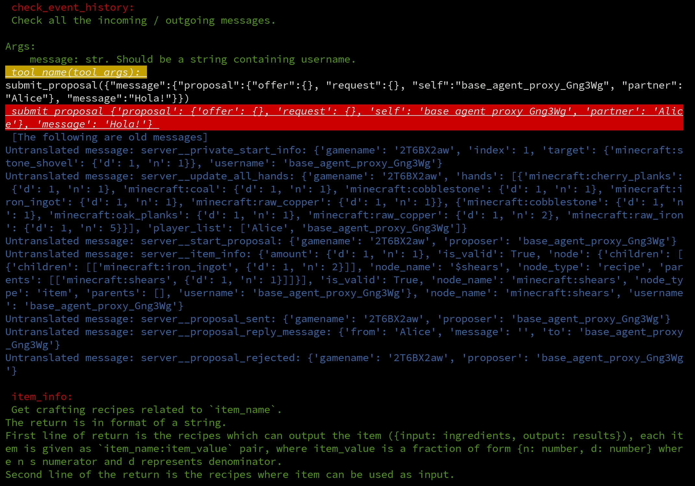

# The Social Imitation Game

This module consists of several supporting modules, together they form a general purpose agent framework which is suitable for different testing environments via SocketIO messaging. Configuration is independent and configurable where one may customize the communication rules and necessary introductions to test it on your own environment.


## Modules and Relations:
- `SIG_core`: the SIG driver which provides basic functionalities.
- `SIG_instances`: the SIG instances that are predefined, or user-defined
- `agent_proxy`: a general-purpose agent proxy interface between SIG agent (via language) and environment (websocket server).
- `proxied_games`: customizable proxied games. The game `tradeCraft` is automatically supported. Depends on `agent_proxy`.


## Quick Start
Our root directory in this section is `/SocialImitationGame/`.
First, try to run a `python run_xxx.py` file to get some taste.
Then try to read that file and see what could be modified.
Basically, those are the choice of `proxied_games` and `SIG_instances` written in the files.
Then, move your steps into `SIG_instances`, see how those works and try to create a new SIG agent from an old one.
Remember, your SIG agent, including structure and prompts, should not be not specifically designed only for your favourite game. Let's make it general!
It is still a blue sea over there!

If you are not satisfied with the default game descriptions, goto `src/proxied_games`, find the task name
and figure out your own description in `language_processor.py`.

Normally, there is no need to visit `src/agent_proxy/` and `src/SIG_core/`, unless you are interested in contributing
in SIG underlying mechanism design.


### Example
Start from root directory of this Repo.

1. Run server:
```bash
cd tradeCraft
python run_server.py
```

2. Run an SIG agent in another terminal:
```bash
cd SocialImitationGame
python run_mturk_example.py
```

3. Open a browser and visit: `http://localhost:5000`
Login -> Enter Game -> Play


4. Then from mturk side:


  - Check item info


  - Submit a proposal (Result will be seen only after you respond accept/reject on your browser!)




## Basic Designing Philosophy

### About world
We treat the world as a turn-based game, the SIG agent is ever-running to play the game via necessary communications via **external tools**.

A `turn` is a concept in a SIG agent's eye as smallest time unit, a `tick` of the world. A SIG agent should determine to take necessary actions in a turn via external tools, and decide to end this turn, deactivate and wait for being awaken at the beginning of the next turn. In `proxied_games`, one can define what is a turn in a customized way. E.g., some may view the whole game as one turn, other may define an action or a communication cycle as a turn.
