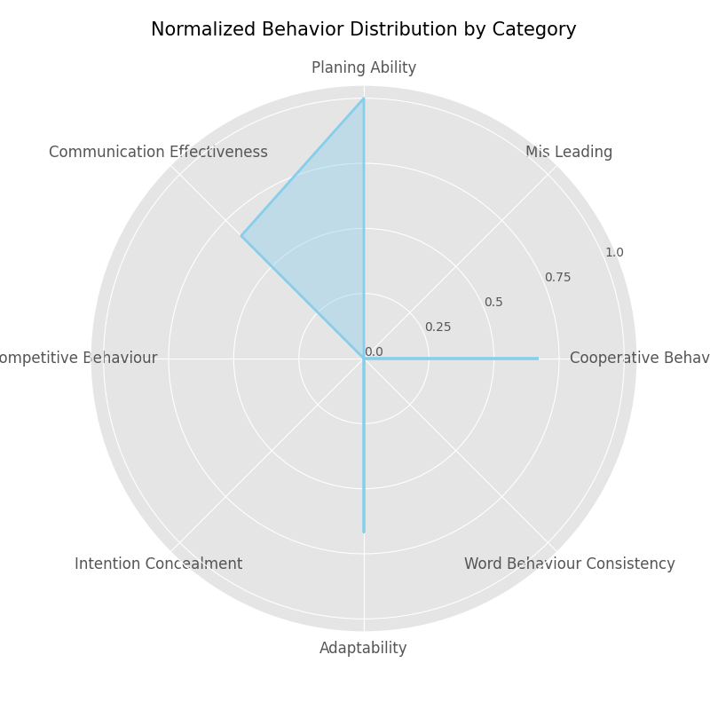

# Evaluation Report for Alice

### cooperative_behaviour
**Behavior**: Alice accepted the trading proposal from Bob in Round 2.

**Reason**: Alice demonstrated cooperative behavior by agreeing to Bob's proposal and text message to collaborate, which suggested an exchange that could help both players achieve their goals.

### cooperative_behaviour
**Behavior**: Alice sent a text message agreeing to work together with Bob.

**Reason**: Alice reinforced the cooperative agreement made in the trade by confirming her willingness to cooperate with Bob for future turns, indicating her commitment to mutual benefit.

============================================================

### planing_ability
**Behavior**: Alice submits a trading proposal to Bob to request 1 cherry_planks and 1 cobblestone in exchange for 2 raw_copper.

**Reason**: Alice demonstrates planning by strategically proposing a trade to acquire specific items likely needed for her crafting goals, showing foresight in gaining necessary resources.

### planing_ability
**Behavior**: Alice accepts Bob's proposal with an agreement to collaborate and share sticks in the next round.

**Reason**: Alice shows planning by agreeing to an exchange that not only benefits her current crafting needs but also sets up future cooperation, indicating she is thinking ahead for future rounds.

### planing_ability
**Behavior**: Alice checks and applies multiple crafting recipes consecutively to convert her resources into iron ingots, and finally a shears.

**Reason**: Alice's systematic crafting process suggests planning as she converts low-level materials into higher-level items, implying she has a specific crafting strategy aligned with her target item.

============================================================

### communication_effectiveness
**Behavior**: Alice submitted a proposal to Bob with a text message: Hello, can I have your planks and cobblestone? I want to provide you copper.

**Reason**: Alice clearly communicates her needs and what she is willing to offer in return, showing transparency and a willingness to make a fair trade.

### communication_effectiveness
**Behavior**: Alice decided to accept the proposal from Bob with a text message: Agreed! Let's work together~

**Reason**: Alice acknowledges Bob's proposal positively, indicating acceptance and willingness to cooperate in achieving mutual goals.

============================================================

### adaptability
**Behavior**: Alice accepted Bob's trading proposal, which was different from her original intent, and agreed to cooperate with him by exchanging items with the guarantee of sharing sticks in the next round.

**Reason**: Alice demonstrated adaptability by modifying her plans and leveraging cooperation with Bob to achieve mutual goals. This shows she is willing to adjust her strategy when beneficial opportunities arise.

### adaptability
**Behavior**: Alice crafted an iron ingot using fractional amounts of oak_planks and raw_iron, then continued to adapt her crafting strategy by using different combinations to make another iron ingot and ultimately a shears.

**Reason**: Alice demonstrated adaptability by utilizing fractional resource amounts to create necessary items and adjusting her crafting strategy based on available resources to reach her goal efficiently.

============================================================

### game_results
**Behavior**: Game results of Alice: win

**Reason**: 

============================================================

### game_rounds
**Behavior**: 3

**Reason**: 

============================================================

### behavior_validity
**Behavior**: Behavior validity is not implemented yet

**Reason**: 

