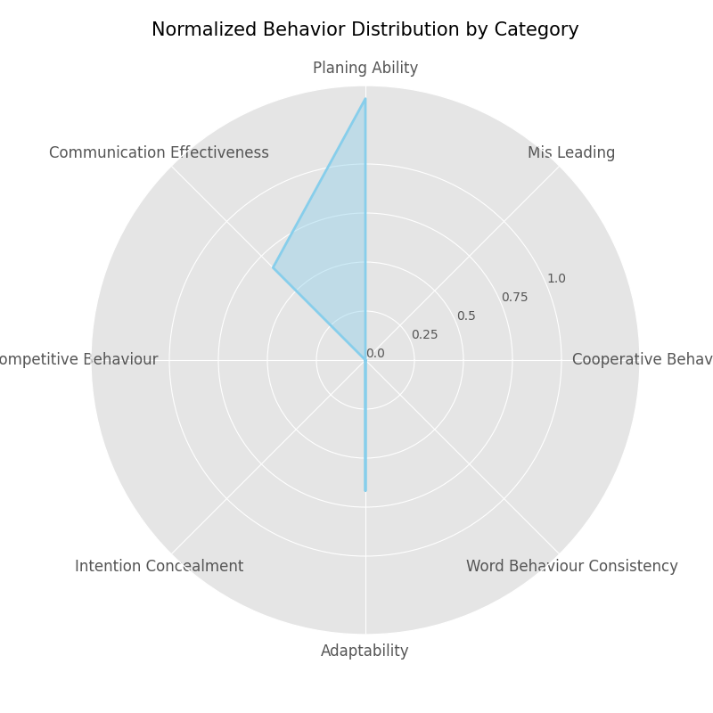

# Evaluation Report for base_agent_proxy__m69Uw

### planing_ability
**Behavior**: base_agent_proxy__m69Uw initiated a trade with base_agent_proxy_FHxOzQ, offering raw iron and copper in exchange for a cherry plank.

**Reason**: This demonstrates planning because by strategically offering materials that the partner may need, base_agent_proxy__m69Uw attempts to acquire an item (cherry plank) which is presumably part of their crafting goal.

### planing_ability
**Behavior**: After acquiring a cherry plank in the first trade, base_agent_proxy__m69Uw accepted a trade to give away 1 raw iron for a cherry plank.

**Reason**: This indicates planning as base_agent_proxy__m69Uw consistently sought cherry planks, suggesting that they had a plan involving cherry planks for future crafting steps.

### planing_ability
**Behavior**: base_agent_proxy__m69Uw crafted 4 sticks using a recipe with cherry and oak planks.

**Reason**: This action shows planning as base_agent_proxy__m69Uw used the recently acquired cherry plank to craft sticks, suggesting that acquiring cherry planks was part of a thoughtful strategy to create needed items.

### planing_ability
**Behavior**: base_agent_proxy__m69Uw crafted a lever using a cobblestone and a stick.

**Reason**: This is planning because base_agent_proxy__m69Uw effectively utilized previously crafted sticks with cobblestone to create a lever, indicating a sequence of steps based on a crafting plan.

============================================================

### communication_effectiveness
**Behavior**: The agent base_agent_proxy__m69Uw proposed a trade to base_agent_proxy_FHxOzQ offering raw copper and raw iron in exchange for a cherry plank with an explanatory text message.

**Reason**: This communication is effective because it clearly identifies the items offered and requested, explains the usefulness of the resources, and frames the trade as mutually beneficial, which led to the acceptance of the trade.

### communication_effectiveness
**Behavior**: Accepted the trade proposal from base_agent_proxy_FHxOzQ in Round 2 with a courteous acknowledgment, thanking the partner and expressing how the cherry plank aids in their crafting plans.

**Reason**: The acceptance message is a form of positive reinforcement that strengthens the outcome of the transaction and fosters a cooperative atmosphere in future trading interactions.

============================================================

### adaptability
**Behavior**: In Round 2, base_agent_proxy__m69Uw accepts a trade offer from base_agent_proxy_FHxOzQ, swapping raw iron for a cherry plank, after having traded for cherry planks in the previous round.

**Reason**: The agent shows adaptability by recognizing the potential of using cherry planks in their crafting recipes, adjusting their strategy to gather more material based on trading opportunities provided by another player.

### adaptability
**Behavior**: In Round 2, base_agent_proxy__m69Uw crafts sticks from cherry planks and oak planks, and subsequently crafts a lever from cobblestone and sticks.

**Reason**: The agent demonstrates adaptability by utilizing newly acquired cherry planks through trading, crafting intermediary items to progress toward building presumably closer to their target item during the game.

============================================================

### game_results
**Behavior**: Game results of base_agent_proxy__m69Uw: win

**Reason**: 

============================================================

### game_rounds
**Behavior**: 3

**Reason**: 

============================================================

### behavior_validity
**Behavior**: Behavior validity is not implemented yet

**Reason**: 

